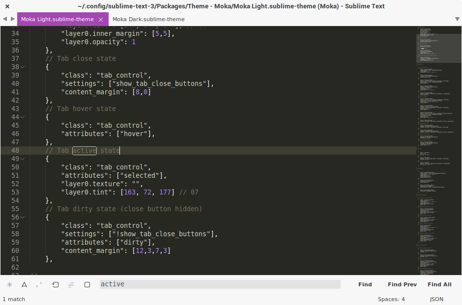
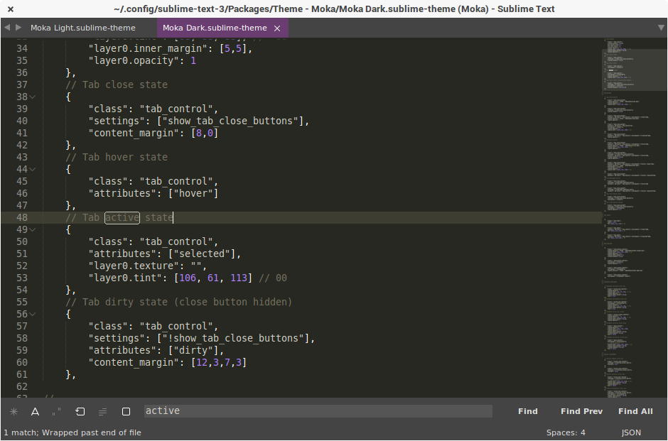

# Moka Sublime Text Theme

A set of custom UI themes for Sublime Text 2/3  that match [Moka GTK+ theme](http://mokaproject.com/moka-gtk-theme/), based on [Spacegray](https://github.com/kkga/spacegray).

*The theme is no longer maintained, as the GTK+ theme is no longer being developed, sorry.*

## Themes

### Moka Light

Default flavour.



### Moka Dark

Dark variation.



*The font used in the screenshots is __Droid Sans__.*

## How to Install

### Via Package Control

The easiest way to install is using [Sublime Package Control](https://sublime.wbond.net), where Moka is listed as `Theme - Moka`.

1. Open Command Palette using menu item `Tools -> Command Palette...` (<kbd>Ctrl</kbd>+<kbd>Shift</kbd>+<kbd>P</kbd>).
2. Choose `Package Control: Install Package`
3. Find `Theme - Moka` and hit Enter

### Manual

You can also install the theme manually:

1. [Download the .zip](https://github.com/aldomann/sublime-moka/archive/master.zip)
2. Unzip and rename the folder to `Theme - Moka`
3. Copy the folder into `Packages` directory, which you can find using the menu item `Sublime Text -> Preferences -> Browse Packages...`

### Git Installation

Alternatively, if you are a git user, you can install the theme and keep up to date by cloning the repo directly into your Packages directory in the Sublime Text application settings area.

1. Open a Terminal.
2. Move to the `Packages` directory (you can find its location by choosing `Package Control: Browse Packages` in the `Command Palette`).
3. Run `git clone https://github.com/aldomann/sublime-moka.git`.

## How to Activate

Activate the UI theme and color scheme by modifying your user preferences file, which you can find using the menu item `Sublime Text -> Preferences -> Settings - User`.

You can choose whichever flavor you like, but don't forget to change *both* color scheme and UI theme so they match.

***Note: Don't forget to restart Sublime Text after activating the theme.***

### Settings for Moka Dark

```
{
  "theme": "Moka Dark.sublime-theme"
}
```

### Settings for Moka Light

```
{
  "theme": "Moka Light.sublime-theme"
}
```
